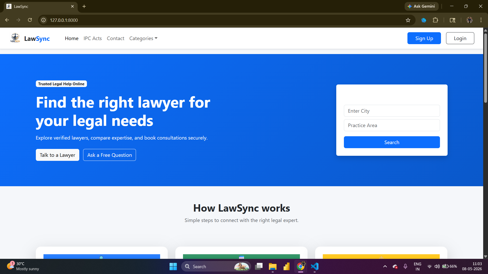
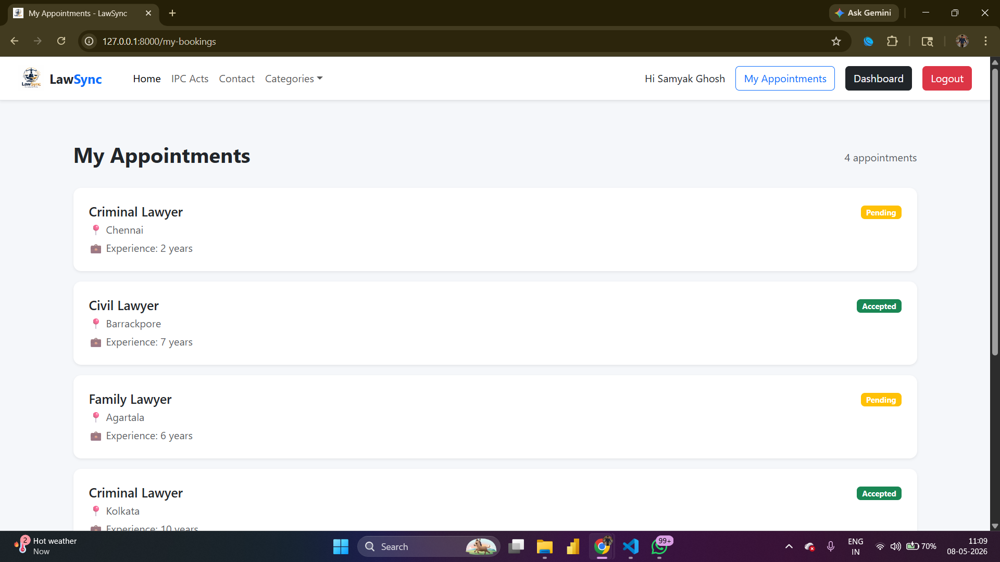
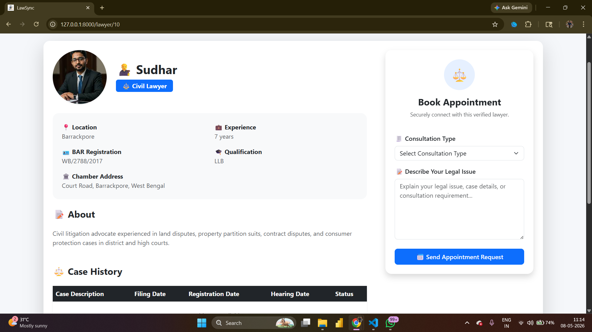
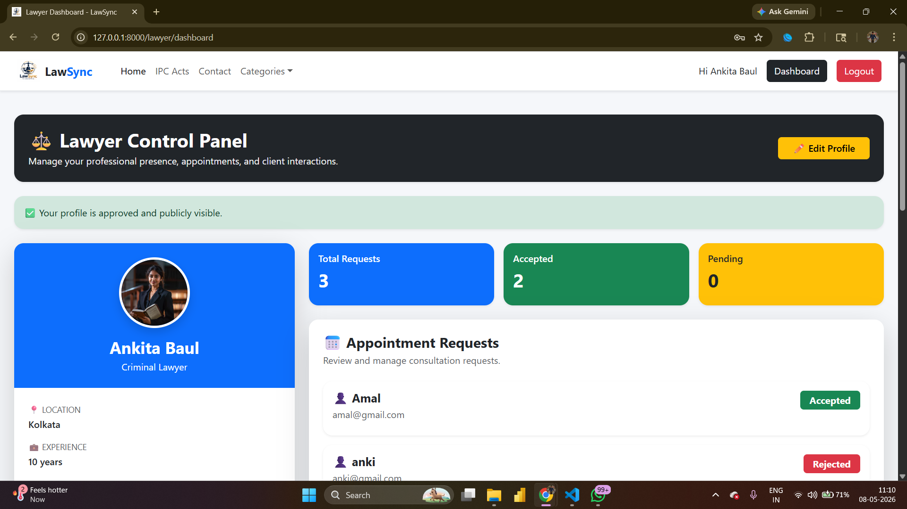
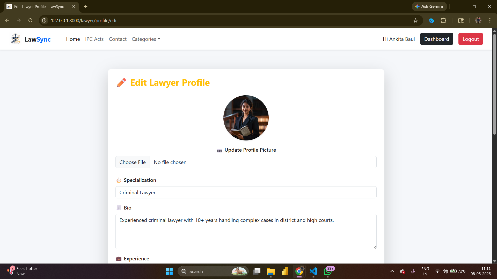

⚖️ LawSync – Legal Consultation & Lawyer Appointment System
📌 Project Overview

LawSync is a web-based Legal Consultation and Lawyer Appointment Management System developed using Laravel and MySQL. The platform connects users with verified lawyers, enabling appointment booking, case history management, lawyer profile management, reviews and ratings, and administrative monitoring.

The system aims to simplify the process of finding legal assistance and managing lawyer-client interactions through a centralized digital platform.

🎯 Objectives
Connect users with professional lawyers.
Simplify appointment booking.
Maintain case history records.
Allow lawyer profile verification.
Provide review and rating functionality.
Enable efficient platform administration.

🚀 Features

👤 User Module
User Registration & Login
Search Lawyers by Specialization
View Lawyer Profiles
Book Appointments
Track Appointment Status
View Case History
Submit Reviews & Ratings
Manage Profile

⚖️ Lawyer Module
Lawyer Registration
Profile Management
Accept/Reject Appointments
Upload Case Histories
Manage Professional Information
View Reviews & Ratings

🛠️ Admin Module
Dashboard Analytics
Manage Users
Manage Lawyers
Verify Lawyer Accounts
Monitor Appointments
Platform Statistics

🏗️ Technology Stack
Technology	Used For
Laravel 12	Backend Framework
PHP	Server-side Development
MySQL	Database
Bootstrap 5	Frontend UI
HTML/CSS	User Interface
JavaScript	Client-side Logic
Chart.js	Dashboard Analytics

📊 Database Entities
Users
Lawyers
Appointments
Case Histories
Reviews

🔄 System Workflow
User registers and logs in.
User searches lawyers by specialization.
User books an appointment.
Lawyer receives appointment request.
Lawyer accepts or rejects appointment.
Lawyer uploads case history updates.
User views appointment and case status.
User posts reviews and ratings.
Admin monitors overall platform activity.

📷 Screenshots
Home Page

Lawyer Listing

Appointment Booking

Lawyer Dashboard

Updation System

⚙️ Installation
Clone the repository:

git clone https://github.com/Samyak2319/LawSync-Legal-Consultation-System.git

Move into the project folder:

cd LawSync-Legal-Consultation-System

Install dependencies:

composer install

Create environment file:

copy .env.example .env

Generate application key:

php artisan key:generate

Configure MySQL database in .env.

Run migrations:

php artisan migrate

Start the development server:

php artisan serve

🔮 Future Enhancements
Real-time Chat System
Video Consultation
AI Legal Assistant

👨‍💻 Author

Samyak Ghosh
B.Tech CSE (Data Science)
